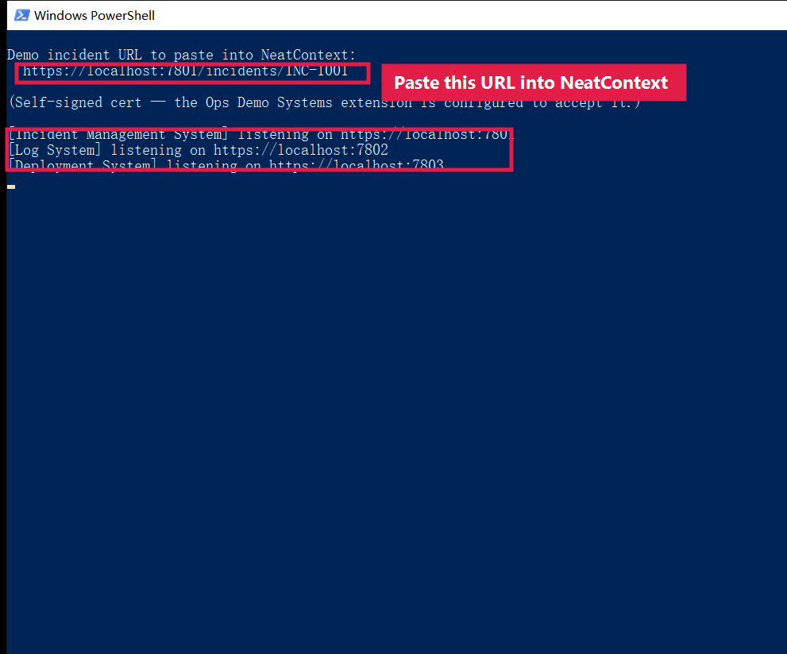
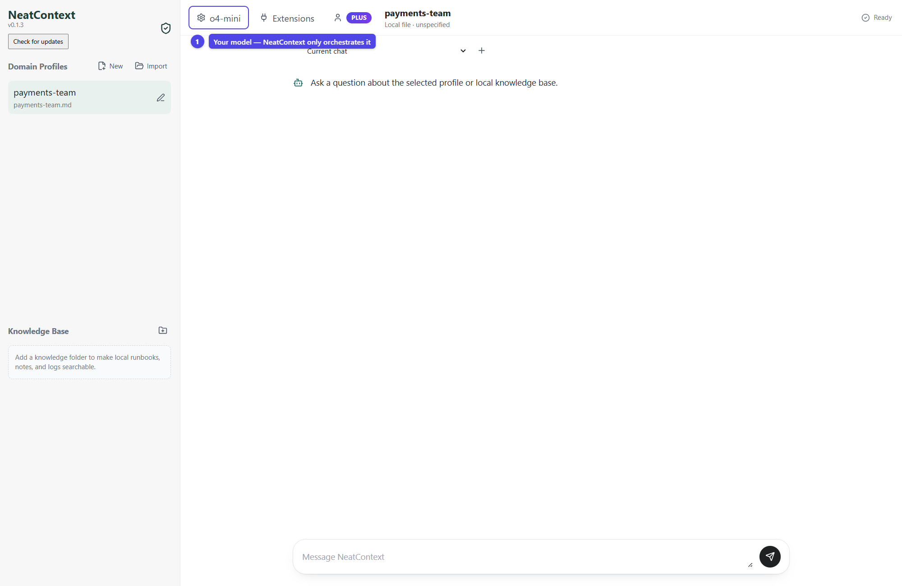
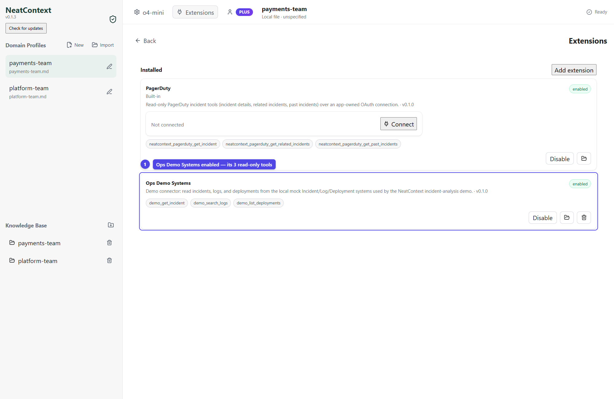
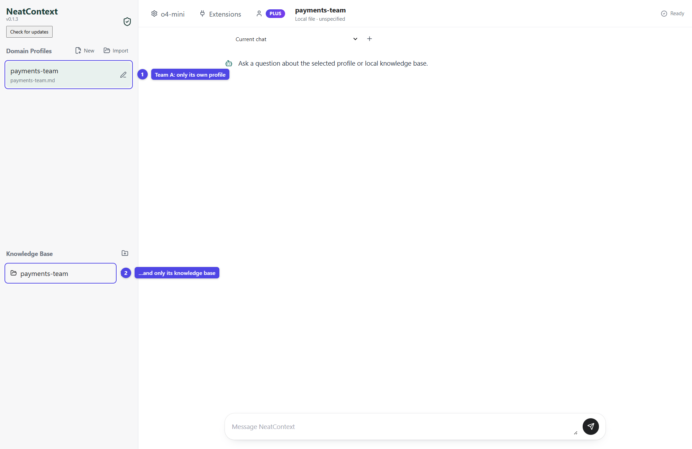
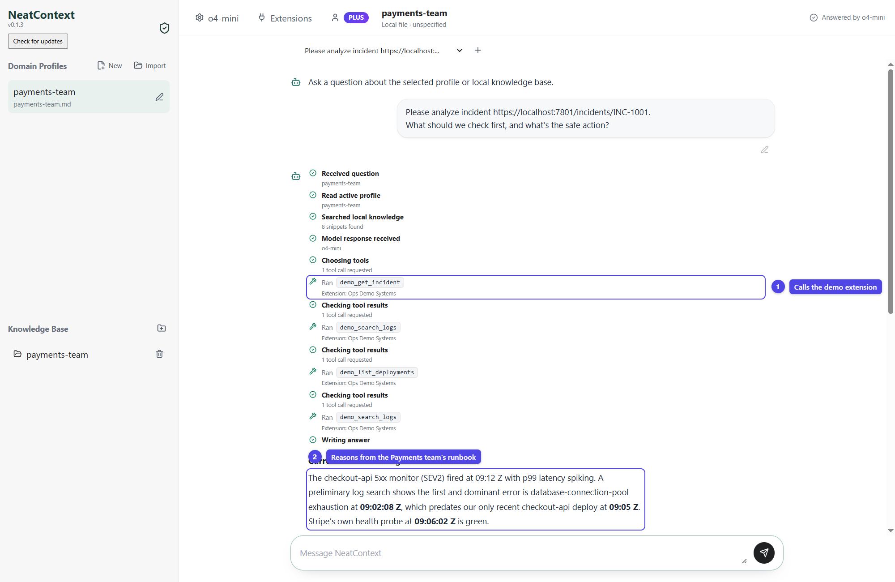
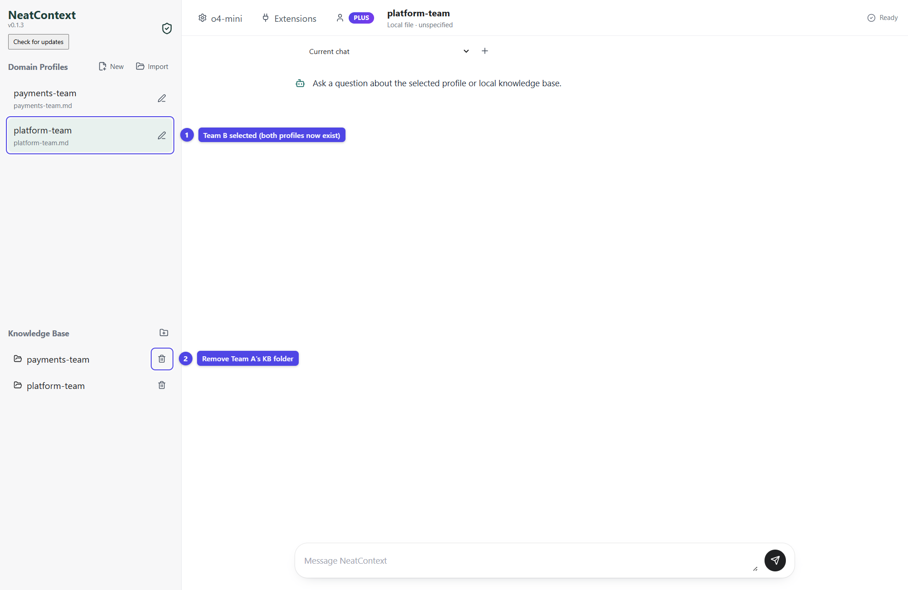
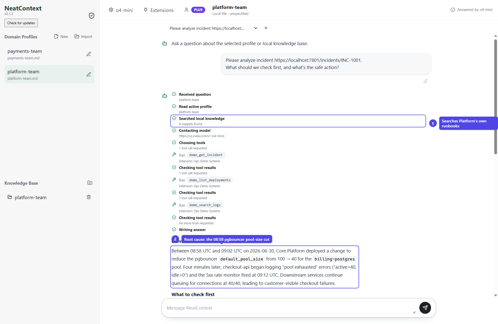

# NeatContext Incident-Analysis Demo

A hands-on demo of **NeatContext**: how giving an LLM a *team's* domain knowledge
(a domain profile + that team's runbooks/TSGs/postmortems + a tool connector)
changes how it investigates an incident. The same incident, analyzed by two
different teams, correctly produces two different outcomes — one team hands the
incident off, the other finds and fixes the root cause.

> New here? Just follow **[How to use it](#how-to-use-it)** top to bottom. The
> **[Scenario](#the-scenario)** and **[Why it works](#what-the-demo-proves)**
> explanations are at the end if you want them.

## What's in the box

| Folder | What it is |
|---|---|
| `servers/` | Three tiny local mock systems — incident management, logs, deployments — pre-filled with realistic data. |
| `extension/` | `Ops Demo Systems`, a NeatContext extension (stdio MCP connector) giving the LLM read-only tools to query those systems. |
| `profiles/` | Two domain profiles you import into NeatContext: `payments-team.md` and `platform-team.md`. |
| `knowledge/` | Each team's runbooks, TSGs, and postmortems — added as NeatContext knowledge bases. |

---

## How to use it

### Prerequisites

- **Node.js 18+** — to run the mock systems. Check: `node --version`.
- **openssl** — to generate the demo's self-signed TLS cert. It ships with Git
  (and is standard on macOS/Linux). Check: `openssl version`.
- **The NeatContext desktop app** — installed and able to open.
- **Your own LLM provider** — an OpenAI-compatible (or Anthropic-compatible) API
  key/endpoint, or a local model. NeatContext does **not** host a model; it
  orchestrates yours. A **tool-calling-capable** model is required so it can call
  the demo tools.

### Step 1 — Clone the repo

```bash
git clone https://github.com/XTSoftwareLabs/neatcontext-demo.git
cd neatcontext-demo
```

There are **no dependencies to install** — the mock systems use only the Node
standard library. Everything below is run from this `neatcontext-demo` folder.

### Step 2 — Start the mock systems

```bash
node servers/index.js
```

On first run it generates a self-signed certificate, then starts all three
systems over HTTPS. You should see:

```
[tls] generated self-signed certificate -> servers/certs/localhost.crt
[Incident Management System] listening on https://localhost:7801
[Log System] listening on https://localhost:7802
[Deployment System] listening on https://localhost:7803

Demo incident URL to paste into NeatContext:
  https://localhost:7801/incidents/INC-1001
```



**Leave this terminal running** for the rest of the demo. Optional sanity check —
open `https://localhost:7801/incidents/INC-1001` in a browser (accept the
self-signed-cert warning). You should get the incident JSON. The extension does
not need you to accept anything; it's configured to trust the demo cert.

> Port already in use? Override with env vars, e.g.
> `INCIDENT_PORT=8801 LOG_PORT=8802 DEPLOY_PORT=8803 node servers/index.js`
> (then also set the matching `NEATCONTEXT_DEMO_*_BASE` vars — see
> [Customizing](#customizing)).

### Step 3 — Open NeatContext and configure your model

1. Launch the NeatContext desktop app.
2. Open model settings and add your LLM provider (base URL, API key, model name).
   Pick a tool-calling-capable model and make it the active model.

The freshly opened app — the active model shows in the top bar, profiles on the
left:



### Step 4 — Add and enable the extension

1. Go to the **Extensions** page.
2. Click **Add extension** and select this repo's **`extension/`** folder
   (the folder that contains `neatcontext-extension.json`). NeatContext copies it
   into its own `userData/extensions/` and loads **Ops Demo Systems**.
3. **Enable** the extension. It declares `connection: none`, so there's nothing
   to authenticate — it talks straight to the local mock systems.

It now exposes three read-only tools to the model:

- `demo_get_incident` — incident details + timeline from the incident system
- `demo_search_logs` — log lines for a service/time window from the log system
- `demo_list_deployments` — recent deploys (change, owning team, risk, rollback)



### Step 5 — Investigate as Team A: Payments Engineering

1. **Import the profile.** In the Domain Profiles panel, click *Import local
   Markdown profile* and choose **`profiles/payments-team.md`**. Make it the
   **active** profile.
2. **Add the knowledge base.** Add the folder **`knowledge/payments-team`** as a
   local knowledge folder.

Team A's workspace has **only the Payments profile and only its knowledge base** —
so the model reasons strictly from this team's context:



3. **Ask, in a new chat:**

   ```
   Please analyze incident https://localhost:7801/incidents/INC-1001.
   What should we check first, and what's the safe action?
   ```



**What you should see.** The model calls `demo_get_incident`, then
`demo_search_logs` / `demo_list_deployments`, searches the Payments runbooks, and
runs the "is this ours?" triage:

- the 5xx started 09:02, **before** the 09:05 checkout-api deploy → our deploy
  isn't the trigger;
- Stripe is **healthy** → not the provider;
- the dominant error is `could not obtain connection from pool 'billing-postgres'`
  → the binding constraint is the **DB connection pool**, which Core Platform owns.

➡️ **Correct outcome for Payments: this is not our root cause — escalate / hand
off to Core Platform**, with the evidence. (Optionally disable
`stripe_webhook_auto_retry` as interim load relief, noting it's *not* the fix.)
A good investigation can correctly end in a hand-off.

### Step 6 — Investigate the SAME incident as Team B: Core Platform / SRE

Now switch the workspace to the other team:

1. **Import the second profile.** Import **`profiles/platform-team.md`**. Both
   profiles now exist in the sidebar — **select `platform-team`** so it's active.
2. **Swap the knowledge base to this team's.** Remove the **`payments-team`**
   knowledge folder (click the trash icon next to it) and add
   **`knowledge/platform-team`**, so only Platform's runbooks are searched.



3. Ask the **exact same question** with the **same incident URL** as Step 5.



**What you should see.** Same tools, same data — but now the model owns the root
cause. It zeroes in on the **08:58 pgbouncer `default_pool_size` 100 → 40
change**, confirms the Postgres primary is healthy (so it's the pool ceiling, not
the database), and gives the **fix + next actions**: revert `default_pool_size` to
100 and RELOAD pgbouncer (no dropped connections), verify the pool drains and 5xx
clears, then monitor pool utilization. It **warns not to fail over the primary**.

That contrast — **same incident, hand-off for one team, root-cause-fix for the
other** — is the whole point of the demo.

---

## Customizing

- **Ports.** Set `INCIDENT_PORT` / `LOG_PORT` / `DEPLOY_PORT` on the launcher, and
  point the extension at them with `NEATCONTEXT_DEMO_INCIDENT_BASE` /
  `NEATCONTEXT_DEMO_LOG_BASE` / `NEATCONTEXT_DEMO_DEPLOY_BASE`.
- **Data.** Edit the incident/log/deploy data inline in the `servers/*.js` files
  to add incidents or richer evidence.
- **Point at real systems.** Set the `NEATCONTEXT_DEMO_*_BASE` vars to your real
  incident/log/deploy APIs (with valid certs) and the same extension pattern works
  beyond the demo.

## Layout

```
neatcontext-demo/
  servers/
    index.js                 # launcher: starts all three mock systems (HTTPS)
    ensure-cert.js           # auto-generates the self-signed localhost cert
    incident-system.js       # https://localhost:7801  (INC-1001)
    log-system.js            # https://localhost:7802
    deployment-system.js     # https://localhost:7803
  profiles/
    payments-team.md         # Team A domain profile
    platform-team.md         # Team B domain profile
  knowledge/
    payments-team/           # Team A runbooks / tsg / postmortems
    platform-team/           # Team B runbooks / tsg / postmortems
  extension/
    neatcontext-extension.json
    server.cjs               # stdio MCP server -> the three mock systems
```

---

## The scenario

A single SEV2 fires: **`INC-1001` — elevated 5xx error rate on `checkout-api`.**

There is **one true root cause**: at 08:58 the Core Platform team cut the
pgbouncer `default_pool_size` from 100 → 40, which starved the `billing-postgres`
connection pool. `checkout-api` (owned by Payments) is a **victim**, not the
cause — its 5xx began at 09:02, *before* the Payments deploy at 09:05, and Stripe
is healthy the whole time.

The demo's point is that the **same incident produces two different — and both
correct — outcomes**, because the right action depends on the team's domain
knowledge:

| | **Payments Engineering** | **Core Platform / SRE** |
|---|---|---|
| Owns | checkout-api, invoice-worker, webhooks | billing-postgres, **pgbouncer**, kafka, mesh |
| What it finds | 5xx predates our deploy; Stripe healthy; dominant error is DB-pool exhaustion we don't own | the 08:58 pgbouncer `default_pool_size` 100→40 change starved the pool |
| Correct outcome | **Not our root cause → escalate / hand off to Core Platform** with the evidence | **Root cause found → revert pool size to 100 + RELOAD**, verify, then monitor |
| Cites | `checkout-api-5xx.md`, `service-ownership.md`, postmortem INC-0931 | `postgres-connection-pool.md`, `db-failover-tsg.md`, postmortem INC-0977 |
| Guardrail it enforces | don't restart invoice-worker in the 09:00–10:00Z settlement window; don't touch pgbouncer/Postgres — escalate | **don't fail over the postgres primary** during business hours |

Same incident URL, same tools, same data. One team correctly concludes "this
isn't ours" and hands off; the other team owns the root cause and fixes it.

## What the demo proves

- **Domain profiles steer reasoning toward the team's correct action.** The only
  thing that changes between Step 5 and Step 6 is the active profile + knowledge
  folder. The incident, the tools, and the raw evidence are identical — yet one
  team correctly **hands off** (the root cause isn't theirs) and the other team
  correctly **finds and fixes** it. Same data, two right answers.
- **The knowledge base grounds the answer.** Each team's runbooks/TSGs/postmortems
  give the model team-specific first-checks and *dangerous-action* rules it would
  not otherwise know.
- **The extension is just an MCP connector.** `extension/server.cjs` is authored
  exactly like any third-party NeatContext extension: a self-contained stdio MCP
  server speaking `Content-Length`-framed JSON-RPC, with no `neatcontext_` tool
  prefix (that prefix is reserved for bundled first-party extensions). Point it at
  *your* real incident/log/deploy systems and the same pattern works in production.
