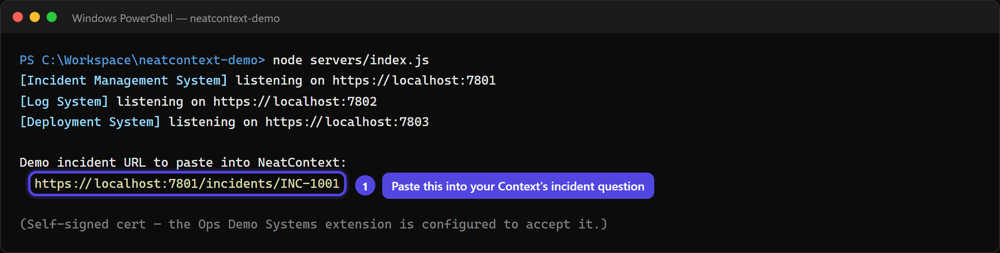
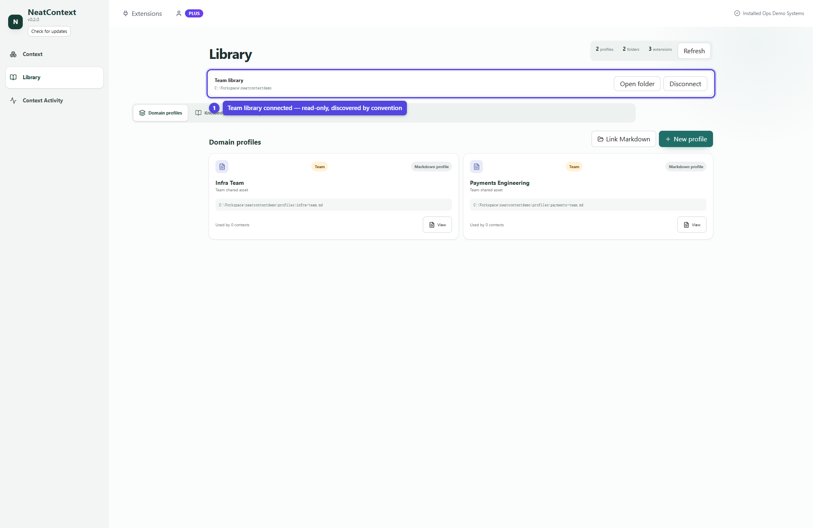
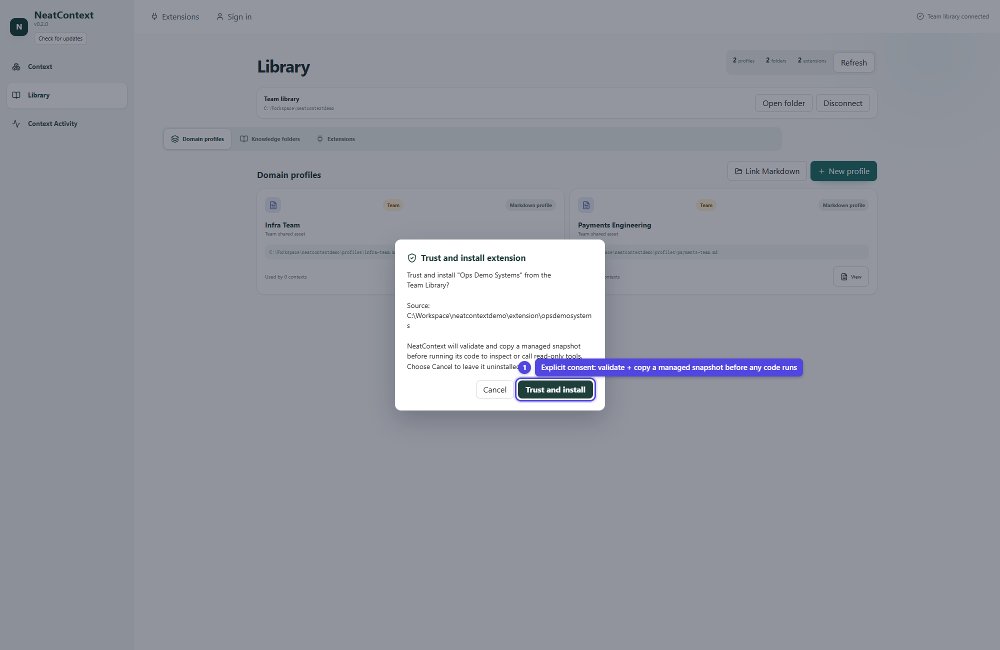
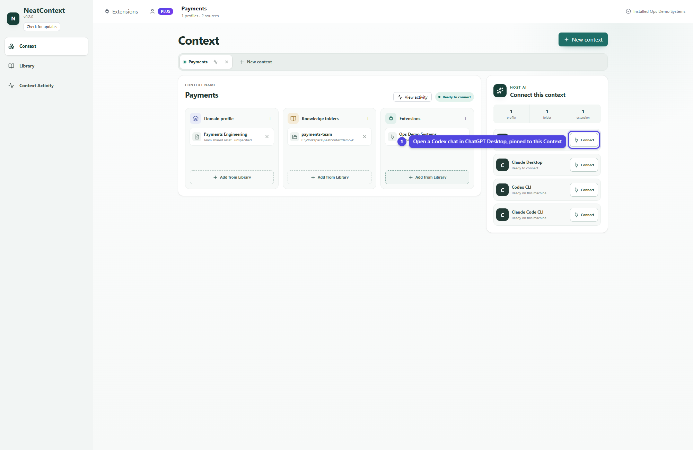
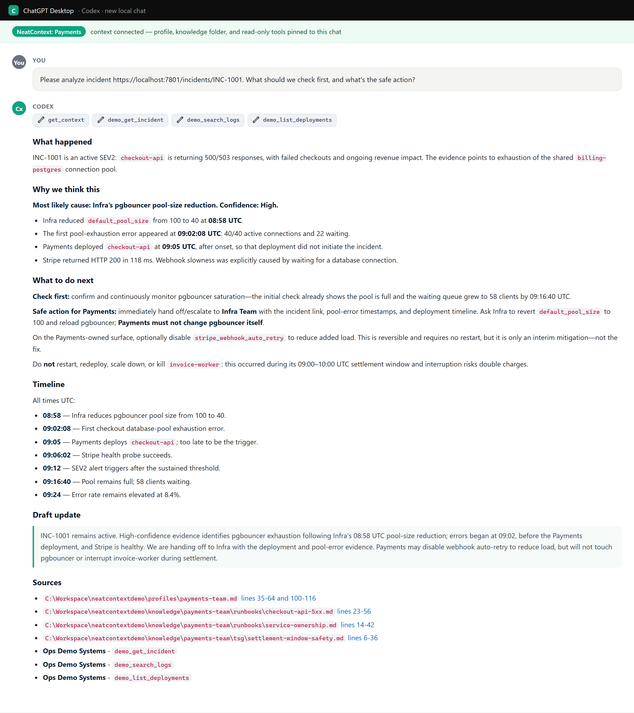
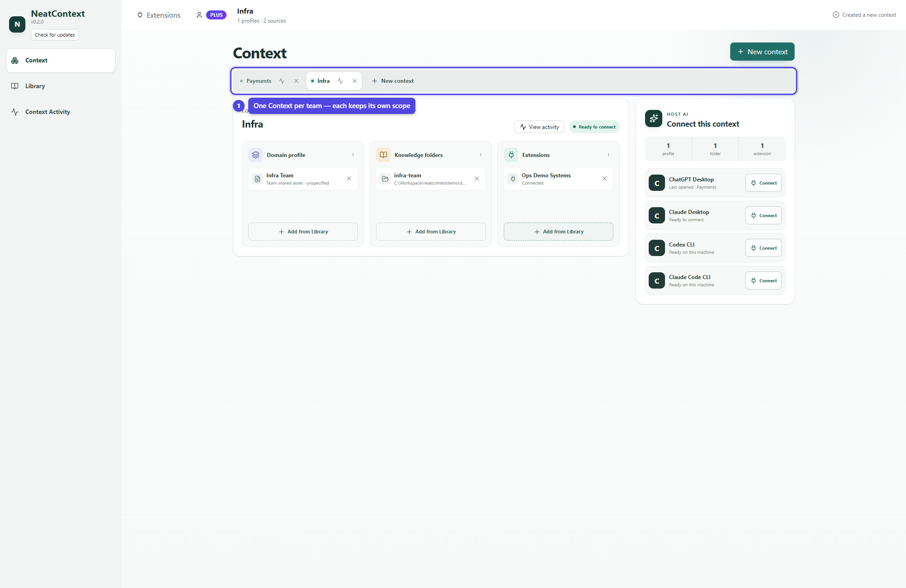
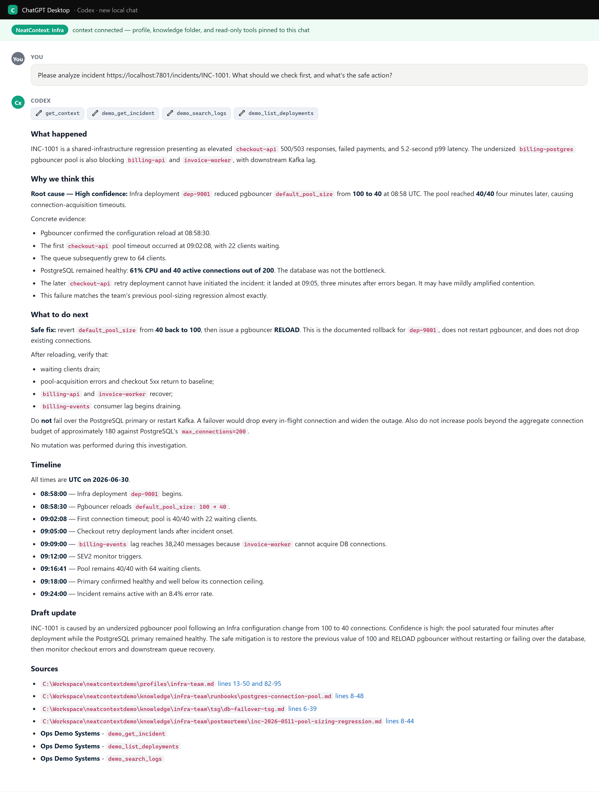
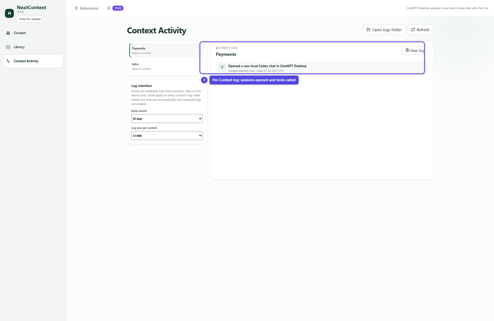

# NeatContext Incident-Analysis Demo

A hands-on demo of **NeatContext**: how giving your AI client a *team's* domain
knowledge (a domain profile + that team's runbooks/TSGs/postmortems + a read-only
tool connector) changes how it investigates an incident. The same incident,
analyzed by two different teams, correctly produces two different outcomes — one
team hands the incident off, the other finds and fixes the root cause.

NeatContext **hosts no model and runs no inference**. It manages context and
serves it to the AI client you already work in — here, **ChatGPT Desktop** through
its local Codex host. You build a *Context* (a profile + knowledge folders + a
trusted read-only extension) in NeatContext, click **Connect**, and ask your
question in the Codex chat that opens. Codex brings its own model, reads the
selected files, searches the folders, and calls the demo tools.

> New here? Just follow **[How to use it](#how-to-use-it)** top to bottom. The
> **[Scenario](#the-scenario)** and **[Why it works](#what-the-demo-proves)**
> explanations are at the end if you want them.

## What's in the box

This repo is a **NeatContext Team Library** (it has a `library.json` marker at the
root). Connect it once and NeatContext discovers everything below by convention.

| Folder | What it is |
|---|---|
| `profiles/` | Two domain profiles NeatContext discovers: `payments-team.md` and `infra-team.md`. |
| `knowledge/` | Each team's runbooks, TSGs, and postmortems — discovered as knowledge folders. |
| `extension/` | `Ops Demo Systems`, a NeatContext extension (stdio MCP connector) giving your AI read-only tools to query the mock systems. |
| `servers/` | Three tiny local mock systems — incident management, logs, deployments — pre-filled with realistic data. |

---

## How to use it

### Prerequisites

- **Node.js 18+** — to run the mock systems. Check: `node --version`.
- **openssl** — to generate the demo's self-signed TLS cert. It ships with Git
  (and is standard on macOS/Linux). Check: `openssl version`.
- **The NeatContext desktop app** — installed and able to open.
- **ChatGPT Desktop** — installed, signed in, with its local **Codex** host
  available. NeatContext connects to that local Codex host (not a hosted plain
  ChatGPT conversation); Codex brings the model. NeatContext stores **no model
  credential** — your ChatGPT/Codex sign-in is the only account involved.

### Step 1 — Clone the repo

```bash
git clone https://github.com/XTSoftwareLabs/neatcontext-demo.git
cd neatcontext-demo
```

There are **no dependencies to install** — the mock systems use only the Node
standard library. Everything below is run from this `neatcontext-demo` folder.

### Step 2 — Start the mock systems

```bash
node servers/index.js
```

On first run it generates a self-signed certificate, then starts all three
systems over HTTPS. You should see:

```
[Incident Management System] listening on https://localhost:7801
[Log System] listening on https://localhost:7802
[Deployment System] listening on https://localhost:7803

Demo incident URL to paste into NeatContext:
  https://localhost:7801/incidents/INC-1001

(Self-signed cert — the Ops Demo Systems extension is configured to accept it.)
```



**Leave this terminal running** for the rest of the demo. Optional sanity check —
open `https://localhost:7801/incidents/INC-1001` in a browser (accept the
self-signed-cert warning). You should get the incident JSON. The extension does
not need you to accept anything; it's configured to trust the demo cert.

> Port already in use? Override with env vars, e.g.
> `INCIDENT_PORT=8801 LOG_PORT=8802 DEPLOY_PORT=8803 node servers/index.js`
> (then also set the matching `NEATCONTEXT_DEMO_*_BASE` vars — see
> [Customizing](#customizing)).

### Step 3 — Connect this repo as a Team Library

1. Launch the NeatContext desktop app and open the **Library** page.
2. On the **Team library** row, click **Connect team library** and choose this
   repo's folder (the one containing `library.json`).

NeatContext scans it read-only — it **never writes into this folder** — and
discovers both domain profiles under `profiles/`, both knowledge folders under
`knowledge/`, and the `Ops Demo Systems` extension package (as an *inert* source,
not yet installed). Everything shows a **Team** badge.



### Step 4 — Install the Ops Demo Systems extension

Team Library extension packages are **inert until you explicitly install them** —
that's the moment you consent to run their code. NeatContext copies a validated
snapshot into its own managed storage; it never executes code from this folder
directly.

Connecting the Team Library (Step 3) immediately offers each discovered extension
for install, so a **Trust and install extension** dialog appears for *Ops Demo
Systems*. Click **Trust and install**. (Declined it, or want to do it later? Open
**Library → Extensions**, find the *Ops Demo Systems* card badged *Team · Available
to install*, and click **Install** — same prompt.)

It declares `connection: none`, so there's nothing to authenticate — it talks
straight to the local mock systems. Once installed it exposes three read-only
tools your AI can call:

- `demo_get_incident` — incident details + timeline from the incident system
- `demo_search_logs` — log lines for a service/time window from the log system
- `demo_list_deployments` — recent deploys (change, owning team, risk, rollback)



### Step 5 — Build the Payments Context and connect ChatGPT Desktop

A **Context** is a named, reusable bundle of exactly the Library resources one team
should reason from. Each Context is independent, so every team gets its own.

1. Open the **Context** page and click **New context**. Name it **Payments**.
2. In **Domain profile**, click *Add from Library* and pick **Payments
   Engineering** (a Context takes exactly one profile).
3. In **Knowledge folders**, add **payments-team**.
4. In **Extensions**, add **Ops Demo Systems**.

The readiness badge flips to **Ready to connect**, and the right-hand panel shows
the scope (1 profile · 1 folder · 1 extension) and the client cards.

5. On the **ChatGPT Desktop** card, click **Connect**.

NeatContext opens a **new local Codex chat inside ChatGPT Desktop**, pinned to this
Context, via a `codex://threads/new?path=…` deep link into a NeatContext-managed
workspace. The first time, ChatGPT Desktop asks you to trust that workspace, its
`UserPromptSubmit` hook, and the `neatcontext` MCP tools — approve them once.



6. **Ask, in the Codex chat that opened:**

   ```
   Please use NeatContext mcp server to analyze incident https://localhost:7801/incidents/INC-1001.
   ```

**What you should see.** Codex calls `get_context` (served by NeatContext),
reads the **Payments Engineering** profile, searches the **payments-team**
knowledge folder, then calls `demo_get_incident`, `demo_search_logs`, and
`demo_list_deployments`, and runs the profile's "is this ours?" triage:

- the 5xx started 09:02, **before** the 09:05 checkout-api deploy → our deploy
  isn't the trigger;
- Stripe is **healthy** → not the provider;
- the dominant error is `could not obtain connection from pool 'billing-postgres'`
  → the binding constraint is the **DB connection pool**, which Infra Team owns.

➡️ **Correct outcome for Payments: this is not our root cause — escalate / hand
off to Infra Team**, with the evidence. (Optionally disable
`stripe_webhook_auto_retry` as interim load relief, noting it's *not* the fix.)
A good investigation can correctly end in a hand-off.

Two levers produced this: the answer is **grounded in the Payments knowledge
base** — it cites `checkout-api-5xx.md`, `service-ownership.md`, and the handoff
postmortem as **clickable `file://` sources** — and the **domain profile shapes the
response**, applying its "is this ours?" triage and its "hand off, don't touch
Infra's surface" rule.



> The answer runs inside ChatGPT Desktop's Codex host with your own account and
> model — NeatContext only served the Context. (The shot here was produced through
> the same NeatContext `get_context` flow against the local mock systems.)

### Step 6 — Analyze the SAME incident as the Infra Team

No swapping profiles in and out — **give Infra its own Context** and leave the
Payments Context exactly as it is.

1. On the **Context** page, click **New context** again. Name it **Infra**.
2. Add the **Infra Team** profile, the **infra-team** knowledge folder, and the
   **Ops Demo Systems** extension.
3. On the **ChatGPT Desktop** card, click **Connect** — a *fresh* local Codex chat
   opens, pinned to the Infra Context. (Connect never reuses the Payments chat; a
   past transcript may hold another team's evidence.)



4. Ask the **exact same question** with the **same incident URL** as Step 5.

**What you should see.** Same tools, same data — but now the model owns the root
cause. It zeroes in on the **08:58 pgbouncer `default_pool_size` 100 → 40
change**, confirms the Postgres primary is healthy (so it's the pool ceiling, not
the database), and gives the **fix + next actions**: revert `default_pool_size` to
100 and RELOAD pgbouncer (no dropped connections), verify the pool drains and 5xx
clears, then monitor pool utilization. It **warns not to fail over the primary**.

Same two levers: the answer **cites Infra's own runbooks**
(`postgres-connection-pool.md`, `db-failover-tsg.md`) as clickable sources, and the
**Infra profile drives the response** — the root-cause fix (revert + RELOAD) and the
guardrail (don't fail over the primary) come straight from its runbook/TSG.



That contrast — **same incident, hand-off for one team, root-cause-fix for the
other** — is the whole point of the demo. Each Context stays put; reconnect either
one anytime to open a fresh chat with exactly that team's context.

### Step 7 — Verify what was actually served

NeatContext has no chat of its own — you verify a Context by looking at its
**activity log**. Open the **Context Activity** page (or click *View activity* on a
Context) and select **Payments** or **Infra**. Each log records, per Context, the
sessions ChatGPT Desktop opened, the Context injected into each turn, and every
`demo_*` / `get_context` tool call — with truncated previews, kept locally only.



---

## Customizing

- **Ports.** Set `INCIDENT_PORT` / `LOG_PORT` / `DEPLOY_PORT` on the launcher, and
  point the extension at them with `NEATCONTEXT_DEMO_INCIDENT_BASE` /
  `NEATCONTEXT_DEMO_LOG_BASE` / `NEATCONTEXT_DEMO_DEPLOY_BASE`.
- **Data.** Edit the incident/log/deploy data inline in the `servers/*.js` files
  to add incidents or richer evidence.
- **Point at real systems.** Set the `NEATCONTEXT_DEMO_*_BASE` vars to your real
  incident/log/deploy APIs (with valid certs) and the same extension pattern works
  beyond the demo.
- **Update shared assets.** Because this is a Team Library (a normal git repo),
  editing a profile or runbook and pushing it is how a team ships an update.
  NeatContext discovers changes on **Refresh**; extension source changes need an
  explicit **Update** before the new code runs.

## Layout

```
neatcontext-demo/
  library.json               # Team Library marker: {"neatcontext": 1}
  profiles/
    payments-team.md         # Team A domain profile
    infra-team.md            # Team B domain profile
  knowledge/
    payments-team/           # Team A runbooks / tsg / postmortems
    infra-team/              # Team B runbooks / tsg / postmortems
  extension/
    opsdemosystems/
      neatcontext-extension.json
      server.cjs             # stdio MCP server -> the three mock systems
  servers/
    index.js                 # launcher: starts all three mock systems (HTTPS)
    ensure-cert.js           # auto-generates the self-signed localhost cert
    incident-system.js       # https://localhost:7801  (INC-1001)
    log-system.js            # https://localhost:7802
    deployment-system.js     # https://localhost:7803
```

---

## The scenario

A single SEV2 fires: **`INC-1001` — elevated 5xx error rate on `checkout-api`.**

There is **one true root cause**: at 08:58 the Infra Team cut the
pgbouncer `default_pool_size` from 100 → 40, which starved the `billing-postgres`
connection pool. `checkout-api` (owned by Payments) is a **victim**, not the
cause — its 5xx began at 09:02, *before* the Payments deploy at 09:05, and Stripe
is healthy the whole time.

The demo's point is that the **same incident produces two different — and both
correct — outcomes**, because the right action depends on the team's domain
knowledge:

| | **Payments Engineering** | **Infra Team** |
|---|---|---|
| Owns | checkout-api, invoice-worker, webhooks | billing-postgres, **pgbouncer**, kafka, mesh |
| What it finds | 5xx predates our deploy; Stripe healthy; dominant error is DB-pool exhaustion we don't own | the 08:58 pgbouncer `default_pool_size` 100→40 change starved the pool |
| Correct outcome | **Not our root cause → escalate / hand off to Infra Team** with the evidence | **Root cause found → revert pool size to 100 + RELOAD**, verify, then monitor |
| Cites | `checkout-api-5xx.md`, `service-ownership.md`, postmortem INC-0931 | `postgres-connection-pool.md`, `db-failover-tsg.md`, postmortem INC-0977 |
| Guardrail it enforces | don't restart invoice-worker in the 09:00–10:00Z settlement window; don't touch pgbouncer/Postgres — escalate | **don't fail over the postgres primary** during business hours |

Same incident URL, same tools, same data. One team correctly concludes "this
isn't ours" and hands off; the other team owns the root cause and fixes it.

## What the demo proves

- **Domain profiles steer reasoning toward the team's correct action.** The only
  thing that differs between the two Contexts is the profile + knowledge base each
  one carries. The incident, the tools, and the raw evidence are identical — yet
  one team correctly **hands off** (the root cause isn't theirs) and the other
  team correctly **finds and fixes** it. Same data, two right answers.
- **Each Context keeps its own scope.** Payments and Infra are separate Contexts in
  one Library — no swapping profiles or knowledge folders in and out. Configure
  each once, then Connect whichever team you need; every Connect opens a fresh
  chat pinned to exactly that Context.
- **NeatContext serves context; your AI does the reasoning.** NeatContext hosts no
  model. It hands ChatGPT Desktop's Codex host the selected profile paths,
  knowledge-folder paths, and allowlisted read-only tools — Codex reads the files,
  searches the folders, calls the tools, and writes the answer with your own model
  and account.
- **The knowledge base grounds the answer.** Each team's runbooks/TSGs/postmortems
  give the model team-specific first-checks and *dangerous-action* rules it would
  not otherwise know, cited back as clickable `file://` sources.
- **The extension is just an MCP connector.** `extension/opsdemosystems/server.cjs`
  is authored exactly like any third-party NeatContext extension: a self-contained
  stdio MCP server speaking `Content-Length`-framed JSON-RPC, with no
  `neatcontext_` tool prefix (that prefix is reserved for bundled first-party
  extensions). Point it at *your* real incident/log/deploy systems and the same
  pattern works in production.
</content>
